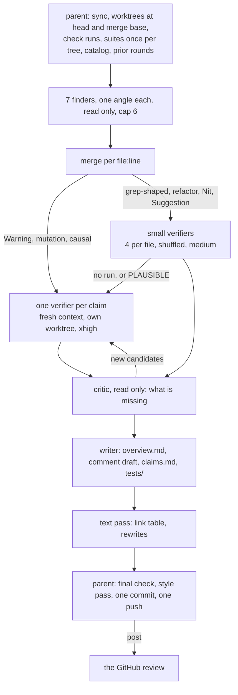

# Skills

My skills: the instruction sets my agents load before working on my projects.

## The concept

Rules matter at the moment an agent writes, and a rule it read an hour ago is
a rule it samples. So every artifact has one skill, the skill is put in context
whole before the first line of the artifact, and a command records that it was.
The hooks do the putting; the gate warns on anything written unread.

Three principles outrank every rule. Build what the task asks for and nothing
speculative. Read the rule before writing the artifact. Measure, never assume:
a convention, a capability and a count come from a command run this session,
never from memory or from a file that recorded them once.

Nothing reaches anyone without my word, typed in the current turn: `post`,
`push`, `merge`. `go`, `ok` and `yes` authorise nothing, and every draft is shown
before it goes. A claim carries the run that proves it. A posted comment says
the problem, its stake and the line it sits on, and stops, so a maintainer who
did not ask for it reads it once; the depth lives in `claims.md`. Replies
to me are clipped, measured, rewritten when they drift, and end on an account
of everything the turn did.

The corpus shrinks on purpose. A rule has one home; it leaves when a script
enforces it or a broader rule covers it; a wording in doubt is measured against
its alternatives before it lands; the lint prints what each file costs. A
workspace mounts this repository as a `skills/` submodule on `main`, live on
the next sync with no bump, and keeps one measured delta per repository in
`projects/<repo>/AGENTS.md`, which wins where the two disagree.

## The words

What I type, and what each word starts, from [`shortcuts.md`](shortcuts.md).

| Word | What it starts |
| --- | --- |
| `review <target>` | one review round: the overview, the comment draft, the claim table and its tests, pushed, nothing posted |
| `review all` | every open target not yet reviewed, the scope written down first |
| `fix <issue or finding>` | a change on the fork: spec, plan, worktree, fix, CI; nothing pushed |
| `try <pr> on <repo>` | the project booted locally, ready to click through |
| `video` | the clip, only once the finding's text is frozen |
| `stop` | the stack and the worktree torn down |
| `report [date]` | the period's status report |
| `post` | the shown draft goes to its target; `post as an AI` adds the marker; `upload` sends media |
| `push` | the whole git flow, every commit and push the work needs, once |
| `merge`, `close`, `delete` | that one action on the named target |
| `make this review public` | the round to the public artifact repo, links repointed |
| `path` | the worktree the work sits in, its path alone |
| "a comment" | the `comment_<model>.md` draft and the text for the target, never an explanation |
| `TLDR` | the answer in one line, and the word it waits on |
| `continue` | the local work resumed, dead agents re-dispatched first; nothing published |
| `+` or `-` on a prompt | that reply lifted to explanation, or cut to the shortest true answer |
| `go`, `ok`, `yes`, `sure`, anything else | local work only, never a publish |

## How I work

Everything starts with a review, on a PR, a branch, or a red CI.
[`review.md`](review.md) drives it:

1. **Fetch and understand.** Sync the checkout, work from a worktree, pull the
   diff, read every comment and past review, then read every changed file in
   full and map its callers. A branch from outside the project gets a static
   danger pass before it is fetched.
2. **Re-review gate.** When a prior round exists, compare patch-ids to tell new
   code from a branch that just moved on its base. A base-only move copies the
   old round forward; nobody re-reviews unchanged code.
3. **Reproduce.** Run the project's own CI commands locally. Every failure is
   re-run on the merge base before the diff gets the blame.
4. **Find.** Seven finders, one angle each, read only: line by line;
   removed and rewritten behaviour, swept by shape; the claims the diff writes
   about itself; the tests it adds, with the mutation that must redden each;
   reachability and extremes; the refactor pass, every added block rewritten
   shorter and run; the invariant catalog walked. Each returns candidates with
   the check that would prove it false, half-believed ones included.
5. **Verify.** A hard claim gets one agent on a fresh context in its own
   worktree, the check run at the head and, when the claim is causal, at the
   merge base; small claims share an agent, four to a file. A verdict quotes
   its run, and a finding whose fix is a test ships the test, paste-ready.
6. **Criticise.** One critic reads every verdict and asks what is missing; its
   candidates verify the same way.
7. **Write.** `overview.md` for the reader who knows nothing about the subject,
   `comment_<model>.md` with one anchored section per finding, posted or
   `SKIP`, and `claims.md`, the record: the verdict, one row per candidate with
   its run output, every claim linked to the reviewed line.
8. **Text pass.** One agent over the draft and the overview: a table of every
   link, resolved or not, then every line that reads shorter without losing
   fact, stake or fix.
9. **Style pass.** The closing Pass of [`writing-style.md`](writing-style.md),
   run against the file and not from memory. Never skipped.
10. **Commit and push.** The record lands in my workspace, nothing else moves.
11. **Hand over.** I read the draft and decide.

## The architecture

One workflow per target, whatever its size: the workspace's
`scripts/workflows/review-pipeline.js`, its stages scaled by
`review-pipeline.json`. The parent prepares and ships; agents find, verify,
criticise and write, each reading only the rule sections its artifact needs,
none reading another's reasoning.



| Stage | Reads | Returns | Tier |
| --- | --- | --- | --- |
| finder, seven | the diff, its angle's rule sections, the catalog | candidates: `file:line`, failure scenario, the check, the band | high, cap 6 per finder |
| verifier | one claim, the claim alone | CONFIRMED, PLAUSIBLE or REFUTED, the run quoted, the artifact under `tests/` | xhigh, one vote |
| small verifier | up to four claims on one file, order shuffled | one verdict each; a weak one escalates | medium |
| critic | every verdict | candidates for what nobody ran | xhigh |
| writer | verified findings, prior rounds | `overview.md`, `comment_<model>.md`, `claims.md` | high |
| text pass | the draft, the overview | the link table, the rewrites applied | xhigh |

The round on disk:

```text
projects/<repo>/reviews/<slug>/
  overview.md            the subject for a reader who knows nothing, no review state
  <n>-<sha>/
    comment_<model>.md   Event, Model, Commit, Overview, Open the code, Round; the Body;
                         one section per finding, posted or SKIP, its repro collapsed
    claims.md            Verdict; one row per candidate: state, band, file:line, the check,
                         the output, the artifact; the link table; the completeness answers
    tests/               every artifact a verifier ran
```

What the round carries in:

- **The invariant catalog**, `projects/<repo>/skills/invariant-catalog.md`: one class per entry with the check that settles it, proposed before a project's first round and extended in the round by every confirmed finding of a class it lacked, so the next round's finders walk it.
- **The context file**, `projects/<repo>/CONTEXT.md`, private: sets the round's pace and shape, and no posted line quotes it or names it.
- **The re-review gate**: patch-ids at the old and new head; equal means the base moved and the round copies forward, different means a full round over what changed, a merge commit means its conflict hunks are diff.
- **Parallel dispatch**: one workflow per target, launched together; a security fix leaves the batch and runs alone first.
- **A target I authored**: no draft, no posting; `claims.md` and `overview.md` still written.

What leaves: nothing without `post`. The commit and push of the record are pre-authorised; a public destination gets the whole diff read as an adversary first.

## What the shape rests on

The review's shape, finders that only read, one verifier per hard claim running
the check, small claims batched in fours, routing by difficulty, one vote,
follows results measured in 2025 and 2026; the field moves fast enough that
older ones are not cited.

- **A verifier runs the check; reading is not verifying.** A tool-running agent identified 95 % of the false positives in static-analysis warnings against 36 % for prompt-only, per [Sifting the Noise 2026](https://arxiv.org/abs/2601.22952); 80 agents agreed on a nonexistent OpenSSL bug and one test killed it, and refuters given the claim alone on a fresh context killed 79 % of candidates, per [Refute-or-Promote 2026](https://arxiv.org/abs/2604.19049).
- **A hard claim gets its own agent; small ones share one, four at most.** A scoring judge lost 45 % of its human agreement at two items per prompt, per [BatchGEMBA 2025](https://arxiv.org/abs/2503.02756); an auditor held to batches of seven and fabricated at eight, per [When Auditors Fabricate 2026](https://arxiv.org/abs/2609.09696); plain question answering on reasoning models held to fifteen, per [Srivastava et al. 2026](https://arxiv.org/abs/2511.04108), so the batch carries only claims one command settles. Order inside a batch is shuffled, since one planted item flips the others' answers in 88 % of batches of twenty, per [Batch Attack 2025](https://arxiv.org/html/2503.15551), and weaker judges lose consistency as the list grows, per [Shi et al. 2025](https://aclanthology.org/2025.ijcnlp-long.18.pdf).
- **Routing by difficulty, on a structural key.** A difficulty model over items and configurations reaches 90 % of the strongest configuration's accuracy at 1 to 10 % of its cost, per [RADAR, ICLR 2026](https://people.umass.edu/~andrewlan/papers/26iclr-radar.pdf); a confidence threshold miscalibrates on the hard items that most need escalation, per [Conformal Cascade 2026](https://arxiv.org/html/2607.25018), so the key here is the band and the check's shape, and a weak small verdict escalates.
- **One vote.** Nine same-family judges carry 2.2 independent votes, and the best single judge beat the panel, per [Nine Judges, Two Effective Votes 2026](https://arxiv.org/html/2605.29800); a cross-family refuter given the claim alone caught 16 % of same-family misses, per Refute-or-Promote above.
- **What the newest designs add and this one lacks.** The best-measured 2026 shape, Refute-or-Promote, gives each hard claim a refuter from another model family, on a fresh context, holding the claim and nothing of the finder's reasoning, then one executed test as the arbiter. This workflow has the fresh context, the claim-only prompt and the executed test; every model it can run is one family, so the cross-family refuter waits for a second provider in the harness.
- **Unmeasured: batched tool-running verifiers on code findings.** The batch of four is extrapolated from judging tasks, and the next rounds measure it.

## The files

| File | Fires when | Produces |
| --- | --- | --- |
| [`review.md`](review.md) | a pull request, a branch or a repository-level failure is reviewed | the review round |
| [`review-modes.md`](review-modes.md) | a run covers many targets, or the reviewer authored the target | the deltas of that case |
| [`review-comment.md`](review-comment.md) | `comment_<model>.md` is drafted, regenerated or posted | the Body, the inline-comment shape, the final check, the posting gate |
| [`issue.md`](issue.md) | a fix needs an upstream issue nobody has filed | `issue.md`, the problem and never the remedy |
| [`change.md`](change.md) | an issue or a finding goes to a pull request | `spec.md` and `plan.md` with their numbered open calls, the worktree, the fix, the local CI run, the pull request on my fork |
| [`pr-body.md`](pr-body.md) | a change is proposed, before the pull request opens | the title and body, in one of four shapes, looping until a full pass changes nothing |
| [`pr-body/docs.md`](pr-body/docs.md) | the change is documentation pages | no headers, the fact the pages had wrong first, a worked example |
| [`pr-body/one-concern.md`](pr-body/one-concern.md) | one concern, which is every bug fix | `## Problem` and `## Fix`, four short paragraphs, a worked example |
| [`pr-body/several-changes.md`](pr-body/several-changes.md) | several independent changes share one pull request | one `###` section per change, each readable alone, a worked example |
| [`pr-body/surface.md`](pr-body/surface.md) | one change with a surface someone sees | `## Problem` with the shot, `## Design` with one `###` per decision, a worked example |
| [`try.md`](try.md) | a project is booted at a pull request, a branch or its default branch | a URL, a login, the click path; the clip once the claim is settled |
| [`report.md`](report.md) | a periodic status report over a set of repositories | the report, generated only after I have edited its context file |
| [`git.md`](git.md) | a turn will commit, push, sync a checkout, or touch a submodule or worktree | the identity every commit takes, where a push goes, the commands that report success and move nothing |
| [`writing-style.md`](writing-style.md) | any visible prose, in any project | the rules every other skill defers to, the closing Pass, the chat register, the posted-comment shape |
| [`shortcuts.md`](shortcuts.md) | every reply, in any workspace | the words, the shape of a reply, the account of what a turn did, the closing block |
| [`authoring.md`](authoring.md) | a rule is added, edited or removed | where it lives, the shape it takes, what it displaces |
| [`archive/`](archive/) | nothing loads it | snapshots of a skill before a change that altered its voice, and the advisory shape for a disclosure |
| [`TODO.md`](TODO.md) | skill work I own but have not started | one line per item, newest last |

## The chat register

cvm is the register every chat reply takes, defined in `skills/short-form.md`, the Short form
of [`writing-style.md`](writing-style.md). The rules live there and are not
restated here.

[`tests/chat-register/`](tests/chat-register/) is the harness that chose the
wording: candidate wordings against no rule and against the caveman plugin on
that plugin's own benchmark prompts, articles, filler, hedges and words per
sentence counted with code excluded, and a blind judge ranking every answer on
single-pass readability; [`results.md`](tests/chat-register/results.md) is the
run.

[`scripts/reply-check.py`](scripts/reply-check.py) is what keeps it: it reads
the turn's final reply off the transcript, drops fenced code, inline code,
blockquotes, table rows, link targets, anything between two `---` rules and the
`Did:` account, and measures what is left. Over 200 prose words, 5 articles per
hundred, 12 words per sentence, any hedge or pleasantry, an account missing
above a closing block or sitting in a code fence, and the numbers go into the
next prompt's context; nothing blocks, no reply is printed twice. A reply under
30 words of prose, or one answering a `+` prompt, is not measured.

```bash
./skills/scripts/reply-check.py <file>                          # the numbers for a text file
./skills/scripts/reply-check.py --scan <transcript>.jsonl... --since 2026-09-06   # replies measured and drifted, per session
```

## The read gate

[`scripts/skill-gate.py`](scripts/skill-gate.py) records every read made
through [`scripts/skill`](scripts/skill), `./scripts/skill review` for a skill,
`./scripts/skill pr-body/docs` for a shape, `./scripts/skill meet` for a
project's delta. It puts the skills a write still lacks into the context with a
warning and lets the write through, and puts the rules in the context itself:
the four every session needs as it opens, `writing-style`, `shortcuts`, `git`
and the workspace layout, the task's and the repository's on the prompt that
names them, everything again after a compaction. A read holds while the file's
hash matches and the session is the same; a stale read prints only the diff
since it was made.

[`scripts/git-hooks/`](scripts/git-hooks/) holds the commit, merge-commit and
push hooks, which warn on a mapped artifact whose skill was not read, whatever
made the commit. [`scripts/tests/`](scripts/tests/) holds the tests of the gate
and of the register check.

```bash
git config core.hooksPath skills/scripts/git-hooks
git -C skills config core.hooksPath scripts/git-hooks
python3 -m unittest discover -s skills/scripts/tests
```

The harness adapter lives in the workspace's own settings file, never here:
its before-write hook on `Write|Edit|MultiEdit|Bash` calls
`skill-gate.py hook-claude`, its session-start hook `session-start`, its prompt
hook `prompt`, and its stop hook `reply-check.py`. Another harness wires its
before-write hook to `skill-gate.py check <path>` and exports its session id as
`CLAUDE_CODE_SESSION_ID`; the git hooks hold without any harness.

## The lint

[`lint.py`](lint.py) warns and never blocks: a rule that tells the reader to
stop measuring, a date or a sha inside a rule, an em-dash or a parenthetical in
prose, a capability asserted without the command that reads it, a pointer at a
file or a section that does not exist, one sentence living in two files, and a
health table per file with its word count, words per rule, negation density and
the share of bullets in bold.

```bash
./skills/lint.py AGENTS.md skills/*.md skills/pr-body/*.md projects/*/AGENTS.md
```
