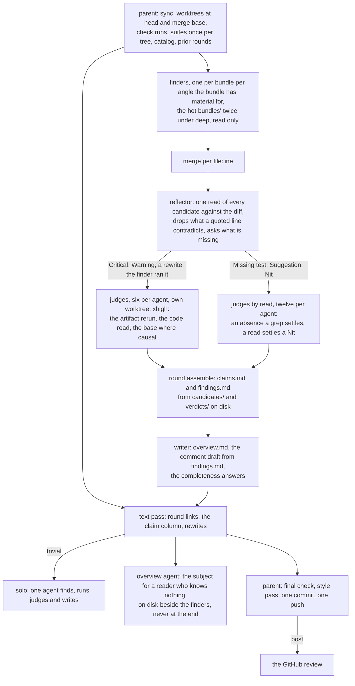

My skills: the instruction sets my agents load before working on my projects.

## Three reviews

| Word | For | Cost, projected today |
| --- | --- | --- |
| `quick review <target>` | the overview of what a change is worth: one finder per bundle on the Warning-finding angles, each running its own Warning checks, judges in short parallel batches, no reflector, no text pass | about 7 agents, 310k output, 40 minutes |
| `review <target>` | any change; a triage names the class first and a simple change runs one finder per bundle, one judge and the writer, a trivial one a single agent; the normal round: one finder per bundle per angle, each running its own Warning checks, the reflector, judges by six over the run-shaped candidates and by twelve over the reads, the writer, the text pass | about 24 agents, 1.1M output, 60 minutes |
| `deep review <target>` | code that is complex or unknown: a second round on every bundle that yielded, one judge per run-shaped candidate, the ceiling | about 57 agents, 2.2M output, 90 minutes |

### The shape follows the change

A triage agent runs before any stage is sized: one short read of the diff, the risk table and the material, naming the change's class. The class moves the knobs; the word only caps it, `quick` at simple, `deep` at complex. Size is one factor and never the trigger.

| Class | The change | The round | Seven lines, projected |
| --- | --- | --- | --- |
| trivial | no behaviour changes: a doc, a comment, a rename, a version bump | one solo agent finds, runs what it bands Warning, judges and writes | 2 agents, ~64k output, about 8 minutes |
| simple | one local behaviour change, one function and its direct callers | one finder per bundle carrying every angle, one judge, the writer; no reflector, no text pass | 5 agents, ~80k, about 17 minutes |
| normal | more than one reach, a new invariant, a guard removed, a test that must turn red | the word's shape | 7 agents, ~113k, about 25 minutes |
| complex | concurrency, consensus, gas, funds, permissions, cryptography, a state machine, unknown code | a second round by yield, one judge per run-shaped candidate, the text pass | |

The useless steps go by themselves: a round that finds nothing runs no judge, no reflector and no text pass; the reflector is skipped under six candidates and the text pass under four findings; the overview is a dozen lines for a simple change. A 1,200-line change on `review` still projects at 24 agents and about 1.1M output, so a seven-line fix costs a tenth of it rather than half.

Every word carries its own output ceiling in `review-pipeline.json`, 400k to 2.5M, past which no verifier is dispatched and the writer still runs; `+<n>` on the word overrides it. The finders run at xhigh in every word: on gno#6187 they returned all six known Warnings at xhigh and three at high, for a sixth less output. The finder runs the checks of its own Criticals and Warnings and writes the artifact; a judge reruns it, reads the code and answers, which is the shape every production reviewer read for this keeps, since over six rounds fresh verifiers rebuilding the work refuted none of 52 Warnings.

The word is how well I know the code, and the cost climbs with it; the plan a
round prints before it launches gives the figures for that diff. What each word
starts is its row in [`shortcuts.md`](https://github.com/davd-gzl/skills/blob/main/shortcuts.md).

## The concept

Rules matter at the moment an agent writes, and a rule it read an hour ago is
a rule it samples. So every artifact has one skill, the skill is put in context
whole before the first line of the artifact, and a command records that it was.
The hooks do the putting; the gate warns on anything written unread.

Three principles outrank every rule. Build what the task asks for and nothing
speculative. Read the rule before writing the artifact. Measure, never assume:
a convention, a capability and a count come from a command run this session,
never from memory or from a file that recorded them once.

Nothing reaches anyone without my word, typed in the current turn: `post`,
`push`, `merge`. `go`, `ok` and `yes` authorise nothing, and every draft is shown
before it goes. A claim carries the run that proves it. A posted comment says
the problem, its stake and the line it sits on, and stops, so a maintainer who
did not ask for it reads it once; the depth lives in `claims.md`. Replies
to me are clipped, measured, rewritten when they drift, and end on an account
of everything the turn did.

The corpus shrinks on purpose. A rule has one home; it leaves when a script
enforces it or a broader rule covers it; a wording in doubt is measured against
its alternatives before it lands; the lint prints what each file costs. A
workspace mounts this repository as a `skills/` submodule on `main`, live on
the next sync with no bump, and keeps one measured delta per repository in
`projects/<repo>/AGENTS.md`, which wins where the two disagree.

## The words

What I type and what each word starts is the table in [`shortcuts.md`](https://github.com/davd-gzl/skills/blob/main/shortcuts.md), the one place a word is defined; `push`, `post` and `merge` are the ones that reach anyone.

## How I work

Everything starts with a review, on a PR, a branch, or a red CI.
[`review.md`](https://github.com/davd-gzl/skills/blob/main/review.md) drives it:

1. **Fetch and understand.** Sync the checkout, work from a worktree, pull the
   diff, read every comment and past review, then read every changed file in
   full and map its callers. A branch from outside the project gets a static
   danger pass before it is fetched.
2. **Re-review gate.** When a prior round exists, compare patch-ids to tell new
   code from a branch that just moved on its base. A base-only move copies the
   old round forward; nobody re-reviews unchanged code.
3. **Reproduce.** Run the project's own CI commands locally. Every failure is
   re-run on the merge base before the diff gets the blame.
4. **Find.** One finder per angle the diff has material for, every angle
   twice under `deep`, read only: line by line; removed and rewritten behaviour, swept by shape;
   the claims the diff writes about itself; the tests it adds, with the
   mutation that must redden each; reachability and extremes; the refactor
   pass, every added block rewritten shorter and run; the invariant catalog
   walked. An angle with nothing to walk is skipped, the plan saying which.
   Each returns candidates with the check that would prove it false,
   half-believed ones included, the read-shaped half of the check run by the
   finder itself, high bands first.
5. **Verify.** A hard claim gets one agent on a fresh context in its own
   worktree, under a tool-call budget, the check run at the head and, when
   the claim is causal, at the merge base; small claims share an agent, four
   to a file; a Nit outside `deep` gets no agent and ships on the finder's
   read, marked unverified. A verdict quotes its run, and a finding whose fix is a test
   ships the test, paste-ready.
7. **Write.** `overview.md` for the reader who knows nothing about the subject,
   `comment_<model>.md` with one anchored section per finding, posted or
   `SKIP`, and `claims.md`, the record: the verdict, one row per candidate with
   its run output, every claim linked to the reviewed line.
8. **Text pass.** `round links` resolves every link of the draft and the
   overview at its sha and checks its range into `links.md`; one agent adds
   whether the landed lines carry each claim, then rewrites every line that
   reads shorter without losing fact, stake or fix.
9. **Style pass.** The closing Pass of [`writing-style.md`](https://github.com/davd-gzl/skills/blob/main/writing-style.md),
   run against the file and not from memory. Never skipped.
10. **Commit and push.** The record lands in my workspace, nothing else moves.
11. **Hand over.** I read the draft and decide.

## The architecture

One workflow per target, whatever its size: the workspace's
`scripts/workflows/review-pipeline.js`, its stages scaled by
`review-pipeline.json`. The parent prepares and ships; agents find, verify,
criticise and write, each reading only the rule sections its artifact needs,
none reading another's reasoning.



| Stage | Reads | Returns | Tier |
| --- | --- | --- | --- |
| finder, one per angle with material, every angle twice under `deep` | the diff with its comments blanked for five angles, its angle's rule sections, the catalog | candidates: `file:line`, failure scenario, the check, the band, whether the finder ran the read-shaped half itself | xhigh, cap 6 per finder and 12 above Nit; `deep` 16 and 16 |
| verifier, the judges | six run-shaped candidates of one bundle per agent, the finder's artifact and evidence in hand, a tool-call budget; twelve read-shaped per agent | CONFIRMED, PLAUSIBLE or REFUTED on the judge's own rerun and read, the exact lines or a concrete input quoted, the base compared where the claim is causal | xhigh |
| writer | verified findings, prior rounds, the candidate rows already tabled | `overview.md`, `comment_<model>.md`, `claims.md` | high |
| text pass | the draft, the overview, `links.md` from `round links` | the claim column, the rewrites applied | xhigh |

The round on disk:

```text
projects/<repo>/reviews/<slug>/
  overview.md            the subject for a reader who knows nothing, no review state
  <n>-<sha>/
    comment_<model>.md   Event, Verdict, Model, Commit, Overview, Open the code, Round; the Body;
                         one section per finding, posted or SKIP, its repro collapsed
    claims.md            one row per candidate: state, band, file:line, the check,
                         the output, the artifact, the tier; the completeness answers
    findings.md          the draft's skeleton from round assemble, one block per finding
                         in posting order, the check on each
    links.md             every link of the draft and the overview, resolved at its sha,
                         its range checked, the claim column
    tests/               every artifact a verifier ran
    candidates/          what each finder and the reflector returned, as JSON
    verdicts/            what each verifier returned, as JSON
```

What the round carries in:

- **The invariant catalog**, `projects/<repo>/skills/invariant-catalog.md`: one class per entry with the check that settles it, proposed before a project's first round and extended in the round by every confirmed finding of a class it lacked, so the next round's finders walk it.
- **The context file**, `projects/<repo>/CONTEXT.md`, private: sets the round's pace and shape, and no posted line quotes it or names it.
- **The re-review gate**: patch-ids at the old and new head; equal means the base moved and the round copies forward, different means a full round over what changed, a merge commit means its conflict hunks are diff.
- **Parallel dispatch**: one workflow per target, launched together; a security fix leaves the batch and runs alone first.
- **A target I authored**: no draft, no posting; `claims.md` and `overview.md` still written.

What leaves: nothing without `post`. The commit and push of the record are pre-authorised; a public destination gets the whole diff read as an adversary first.

## Why each piece

Every decision in the architecture, the reason it was made, and the evidence
behind it. Sources are from 2025 and 2026, since the field moves fast enough
that older ones are not cited. A row marked *reason* rests on this corpus's
own argument and waits for the outcome table to measure it.

| Decision | Why | Evidence |
| --- | --- | --- |
| The finder runs its own Warning checks; a judge reruns and decides | Reading is not verifying: a tool-running agent identified 95 % of false positives in static-analysis warnings against 36 % for prompt-only, and 80 agents agreed on a nonexistent OpenSSL bug that one test killed; over six of our rounds fresh verifiers rebuilding the finder's work refuted none of 52 Warnings, while a lone agent running its own checks refuted three of its six | [Sifting the Noise 2026](https://arxiv.org/abs/2601.22952), the rounds' claims tables |
| A judge in a fresh context, filing no finding of its own | Refuters holding the claim and none of the finder's reasoning killed 79 % of candidates; a validator that cannot log findings is the shape Cloudflare's harness keeps behind hunters that produce the proof | [Refute-or-Promote 2026](https://arxiv.org/abs/2604.19049), Cloudflare, *Build your own vulnerability harness*, 2026 |
| Run-shaped candidates six per judge, reads twelve | A scoring judge lost 45 % of human agreement at two items; an auditor held to seven and fabricated at eight; plain answer extraction held to fifteen, so a rerun-and-read batch stays at six and a read batch at twelve | [BatchGEM 2026](https://arxiv.org/abs/2603.11009) |
| Routing by band: the Warning band and a rewrite get the rerun, the rest a read | A Missing test is an absence a grep settles and a read settles a Nit; on 6187 and 6177 every Nit the verifiers refuted was refuted by reading | the rounds' claims tables |
| Small verifiers on the cheaper family tier | Their checks open with grep, count, ls or wc, or run a refactor's tests, and a weak verdict escalates to a full-tier agent, so a miss there costs one escalation while the stage costs a fifth; the next round's confirmed count against the last measures it | *reason* |
| One vote per claim | Nine same-family judges carry 2.2 independent votes and the best single judge beat the panel; a cross-family refuter caught 16 % of same-family misses, and every model here is one family | [Nine Judges, Two Effective Votes 2026](https://arxiv.org/html/2605.29800), [Refute-or-Promote 2026](https://arxiv.org/abs/2604.19049) |
| Finders and hard verifiers at `xhigh` | On gno#6187 finders at xhigh returned all six known Warnings and finders at high three, for a sixth less output; a miss at the verifier is final | *measured, one run each* |
| Code before the description; the claims angle alone reads the description first | "Bug-free" framing on vulnerable code cut detection by 16.2 to 93.5 points across six models; "vulnerable" framing on clean code raised false positives by 0.8 to 13.6 | [Mitropoulos et al. 2026](https://arxiv.org/abs/2603.18740) |
| Five finders read a copy of head with comment lines blanked | The same framing sits inside the code, in a godoc calling something bounded or safe; the claims angle keeps the comments as its subject, the refactor angle as its lines | [Mitropoulos et al. 2026](https://arxiv.org/abs/2603.18740); *reason* for the extension |
| One reflector, before the verifiers, drops and asks what is missing | It reads every candidate once against the diff, drops only what a code line contradicts, and asks the completeness question the critic used to ask beside the verifiers at three times the cost; its candidates verify in the first wave | *measured: 5 of 75 dropped, 3 on a comment's word, 3 added* |
| Angles gated on the diff's material | An angle with nothing to walk costs a full read and returns nothing: no test file, no tests angle | *reason* |
| A tool-call budget per verifier | One verifier ran 42 minutes and held four stages behind it; a budget ends it PLAUSIBLE with the check named, which the next round runs | *measured* |
| `quick` bounds the wall clock and `cheap` the tokens | A round's minutes are its serial chain, finders, the slowest verifier, the writer, the text pass, and a lower cap or effort leaves that chain as long; quick caps the verifier's tool calls, batches two, and drops the reflector and the text pass | *reason* |
| The catalog walked and extended each round | A finder walking no catalog walks nothing; a confirmed class the catalog lacked is the class it misses next time | *reason* |
| The re-review gate by patch-id | Nobody re-reviews code that did not change; a merge commit's conflict hunks are diff | *reason* |
| Outcome table per posted round | Every number above comes from someone else's task; what authors fixed, resolved or left open per angle, band and tier is what tunes the next batch size, cap and tier | [When Auditors Fabricate 2026](https://arxiv.org/abs/2609.09696) on mechanical verification of every reported finding; *reason* |
| What the newest design adds and this one lacks | A refuter from another model family on each hard claim; every model this harness runs is one family, so it waits for a second provider | [Refute-or-Promote 2026](https://arxiv.org/abs/2604.19049) |

## The files

| File | Fires when | Produces |
| --- | --- | --- |
| [`review.md`](https://github.com/davd-gzl/skills/blob/main/review.md) | a pull request, a branch or a repository-level failure is reviewed | the review round |
| [`review-modes.md`](https://github.com/davd-gzl/skills/blob/main/review-modes.md) | a run covers many targets, or the reviewer authored the target | the deltas of that case |
| [`review-comment.md`](https://github.com/davd-gzl/skills/blob/main/review-comment.md) | `comment_<model>.md` is drafted, regenerated or posted | the Body, the inline-comment shape, the final check, the posting gate |
| [`issue.md`](https://github.com/davd-gzl/skills/blob/main/issue.md) | a fix needs an upstream issue nobody has filed | `issue.md`, the problem and never the remedy |
| [`change.md`](https://github.com/davd-gzl/skills/blob/main/change.md) | an issue or a finding goes to a pull request | `spec.md` and `plan.md` with their numbered open calls, the worktree, the fix, the local CI run, the pull request on my fork |
| [`pr-body.md`](https://github.com/davd-gzl/skills/blob/main/pr-body.md) | a change is proposed, before the pull request opens | the title and body, in one of four shapes, looping until a full pass changes nothing |
| [`pr-body/docs.md`](https://github.com/davd-gzl/skills/blob/main/pr-body/docs.md) | the change is documentation pages | no headers, the fact the pages had wrong first, a worked example |
| [`pr-body/one-concern.md`](https://github.com/davd-gzl/skills/blob/main/pr-body/one-concern.md) | one concern, which is every bug fix | `## Problem` and `## Fix`, four short paragraphs, a worked example |
| [`pr-body/several-changes.md`](https://github.com/davd-gzl/skills/blob/main/pr-body/several-changes.md) | several independent changes share one pull request | one `###` section per change, each readable alone, a worked example |
| [`pr-body/surface.md`](https://github.com/davd-gzl/skills/blob/main/pr-body/surface.md) | one change with a surface someone sees | `## Problem` with the shot, `## Design` with one `###` per decision, a worked example |
| [`try.md`](https://github.com/davd-gzl/skills/blob/main/try.md) | a project is booted at a pull request, a branch or its default branch | a URL, a login, the click path; the clip once the claim is settled |
| [`report.md`](https://github.com/davd-gzl/skills/blob/main/report.md) | a periodic status report over a set of repositories | the report, generated only after I have edited its context file |
| [`git.md`](https://github.com/davd-gzl/skills/blob/main/git.md) | a turn will commit, push, sync a checkout, or touch a submodule or worktree | the identity every commit takes, where a push goes, the commands that report success and move nothing |
| [`writing-style.md`](https://github.com/davd-gzl/skills/blob/main/writing-style.md) | any visible prose, in any project | the rules every other skill defers to, the closing Pass, the chat register, the posted-comment shape |
| [`shortcuts.md`](https://github.com/davd-gzl/skills/blob/main/shortcuts.md) | every reply, in any workspace | the words, the shape of a reply, the account of what a turn did, the closing block |
| [`authoring.md`](https://github.com/davd-gzl/skills/blob/main/authoring.md) | a rule is added, edited or removed | where it lives, the shape it takes, what it displaces |
| [`archive/`](https://github.com/davd-gzl/skills/blob/main/archive) | nothing loads it | snapshots of a skill before a change that altered its voice, the advisory shape for a disclosure, and the harness that chose the Short form wording |
| [`TODO.md`](https://github.com/davd-gzl/skills/blob/main/TODO.md) | skill work I own but have not started | one line per item, newest last |
| [`knowledge/`](https://github.com/davd-gzl/skills/blob/main/knowledge) | a design question about the workflow comes up | one measured fact per file: what holds, the numbers, the source, what it changes |
| [`scripts/scrub.sh`](https://github.com/davd-gzl/skills/blob/main/scripts/scrub.sh) | a push of this repository, from `scripts/git-hooks/pre-push` | a refusal when a pushed line or a commit message carries a secret shape or a name the consumer's `workspace.json` lists |
| [`tools/`](https://github.com/davd-gzl/skills/blob/main/tools) | one Rust crate, two binaries: `round links`, `round prior`, `round risk`, `round dispatch` and `round assemble` for a review round's fixed steps, `rules lint` for this corpus | `links.md` with every link resolved at its sha and its range checked; the earlier rounds' checks re-anchored to the head; the lint below; built by the consumer's sync onto `~/bin` and reached through its `scripts/round` and `scripts/rules` shims, tested by `cargo test --manifest-path tools/Cargo.toml`, a golden fixture under `tools/tests/lint` holding the lint's whole output |

## The chat register

cvm is the register every chat reply takes, defined in `skills/short-form.md`, the Short form
of [`writing-style.md`](https://github.com/davd-gzl/skills/blob/main/writing-style.md). The rules live there and are not
restated here.

[`archive/chat-register/`](https://github.com/davd-gzl/skills/blob/main/archive/chat-register) is the harness that chose the
wording, archived with [`results.md`](https://github.com/davd-gzl/skills/blob/main/archive/chat-register/results.md), its run:
candidate wordings against no rule and against the caveman plugin on that
plugin's own benchmark prompts, with a blind judge ranking every answer.

[`scripts/reply-check.py`](https://github.com/davd-gzl/skills/blob/main/scripts/reply-check.py) is what keeps it: it reads
the turn's final reply off the transcript, drops fenced code, inline code,
blockquotes, table rows, link targets, anything between two `---` rules and the
`Did:` account, and measures what is left. Over 200 prose words, 5 articles per
hundred, 12 words per sentence, any hedge or pleasantry, an account missing
above a closing block or sitting in a code fence, and the numbers go into the
next prompt's context; nothing blocks, no reply is printed twice. A reply under
30 words of prose, or one answering a `+` prompt, is not measured.

```bash
./skills/scripts/reply-check.py <file>                          # the numbers for a text file
./skills/scripts/reply-check.py --scan <transcript>.jsonl... --since 2026-09-06   # replies measured and drifted, per session
```

## The read gate

[`scripts/skill-gate.py`](https://github.com/davd-gzl/skills/blob/main/scripts/skill-gate.py) records every read made
through [`scripts/skill`](https://github.com/davd-gzl/skills/blob/main/scripts/skill), `./scripts/skill review` for a skill,
`./scripts/skill pr-body/docs` for a shape, `./scripts/skill meet` for a
project's delta. It puts the skills a write still lacks into the context with a
warning and lets the write through, and names the rules by path for the Read
tool: the two `CLAUDE.md` imports as the session opens, `shortcuts` and
`short-form`, recorded as read; the task's and the repository's on the prompt
that names them; everything the session had read, again after a compaction. A
read holds while the file's
hash matches and the session is the same; a stale read prints only the diff
since it was made.

[`scripts/git-hooks/`](https://github.com/davd-gzl/skills/blob/main/scripts/git-hooks) holds the commit, merge-commit and
push hooks, which warn on a mapped artifact whose skill was not read, whatever
made the commit. [`scripts/tests/`](https://github.com/davd-gzl/skills/blob/main/scripts/tests) holds the tests of the gate
and of the register check.

```bash
git config core.hooksPath skills/scripts/git-hooks
git -C skills config core.hooksPath scripts/git-hooks
python3 -m unittest discover -s skills/scripts/tests
```

The harness adapter lives in the workspace's own settings file, never here:
its before-write hook on `Write|Edit|MultiEdit|Bash` calls
`skill-gate.py hook-claude`, its session-start hook `session-start`, its prompt
hook `prompt`, and its stop hook `reply-check.py`. Another harness wires its
before-write hook to `skill-gate.py check <path>` and exports its session id as
`CLAUDE_CODE_SESSION_ID`; the git hooks hold without any harness.

## The lint

[`rules lint`](https://github.com/davd-gzl/skills/blob/main/tools/src/lint.rs) warns and never blocks: a rule that tells the reader to
stop measuring, a date or a sha inside a rule, an em-dash or a parenthetical in
prose, a capability asserted without the command that reads it, a pointer at a
file or a section that does not exist, one sentence living in two files, and a
health table per file with its word count, words per rule, negation density and
the share of bullets in bold.

```bash
rules lint AGENTS.md skills/*.md skills/pr-body/*.md skills/knowledge/*.md projects/*/AGENTS.md
```
